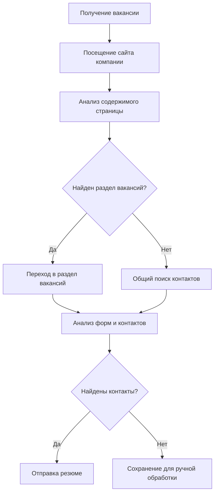

# 🤖 HR Skip Bot

Автоматизированный помощник по поиску работы на базе Telegram и искусственного интеллекта. Бот анализирует вакансии на HH.ru, находит контакты работодателей на их сайтах и автоматически отправляет сопроводительные письма.

## 🏗️ Архитектура

### Основные компоненты

```
src/
├── index.js              # Точка входа приложения
├── models/               # Модели данных MongoDB
│   ├── User.js          # Модель пользователя
│   └── JobApplication.js # Модель заявки на вакансию
├── services/            # Бизнес-логика
│   ├── TelegramBot.js   # Telegram бот
│   ├── HhApiService.js  # Интеграция с HH.ru API
│   ├── LlmAgent.js      # ИИ-агент для анализа сайтов
│   ├── EmailService.js  # Отправка email
│   └── DatabaseService.js # Работа с БД
└── config/              # Конфигурационные файлы
```

### Схема работы LLM-агента



## 🛠️ Технологии

### Основной стек
- **Node.js 18+** - Серверная платформа
- **MongoDB** - База данных
- **Telegram Bot API** - Интерфейс бота
- **OpenAI GPT-3.5/4** - ИИ для анализа сайтов

### Библиотеки
- **telegraf** - Telegram Bot Framework
- **mongoose** - ODM для MongoDB
- **puppeteer** - Браузерная автоматизация
- **nodemailer** - Отправка email
- **axios** - HTTP-клиент
- **cheerio** - Парсинг HTML
- **express** - Web-сервер
- **pm2** - Process Manager

## 🚀 Быстрый старт

### 1. Клонирование и установка

```bash
git clone <repository-url>
cd hrskipbot
npm install
```

### 2. Конфигурация

```bash
cp env.example .env
```

Заполните `.env` файл:

```env
# Telegram Bot
BOT_TOKEN=your_telegram_bot_token

# HH.ru API
HH_CLIENT_ID=your_hh_client_id
HH_CLIENT_SECRET=your_hh_client_secret
HH_REDIRECT_URI=http://localhost:3000/auth/callback

# OpenAI
OPENAI_API_KEY=your_openai_api_key

# Email (SMTP)
SMTP_HOST=smtp.gmail.com
SMTP_PORT=587
SMTP_USER=your_email@gmail.com
SMTP_PASS=your_smtp_password

# Database
MONGODB_URI=mongodb://127.0.0.1:27017/hhbot
REDIS_URL=redis://localhost:6379 (optional)

# Application
PORT=3000
NODE_ENV=development
ADMIN_IDS=user_id1,user_id2 (optional)
```

### 3. Запуск

#### Локальный запуск
```bash
npm run dev  # Development mode
npm start    # Production mode
```

#### Docker
```bash
docker-compose up -d
```

## 📋 Функционал

### 🤖 Telegram бот команды

- `/start` - Начало работы
- `/search` - Поиск вакансий
- `/settings` - Настройки профиля
- `/status` - Статистика отправки
- `/resume` - Управление резюме
- `/help` - Справка

### ⚙️ Настройки пользователя

- **Ключевые слова** - для поиска вакансий
- **Локация** - город/регион
- **Зарплата** - желаемый диапазон
- **Email** - для отправки резюме
- **Шаблон письма** - сопроводительное письмо

### 🔍 Алгоритм работы

1. **Поиск вакансий** - через HH.ru API или по резюме
2. **Анализ сайта** - ИИ посещает сайт компании
3. **Поиск контактов** - находит email/формы для связи
4. **Отправка резюме** - автоматическая отправка письма

## 🌐 Деплой

### 🏠 REG.RU + ISPmanager (Рекомендую для России) ⭐

Если у вас есть сервер на REG.RU с ISPmanager, это идеальный вариант для деплоя в России.

#### 🚀 Быстрый деплой (автоматизированный)

```bash
# Скачать и запустить скрипт деплоя
curl -fsSL https://raw.githubusercontent.com/your-username/hrskipbot/main/deploy-reg-ru.sh | bash

# Или скачать и выполнить локально:
wget https://raw.githubusercontent.com/your-username/hrskipbot/main/deploy-reg-ru.sh
chmod +x deploy-reg-ru.sh
sudo ./deploy-reg-ru.sh
```

**Скрипт автоматически:**
- ✅ Установит Node.js, MongoDB, PM2
- ✅ Склонирует проект
- ✅ Настроит переменные окружения
- ✅ Запустит приложение через PM2
- ✅ Настроит Nginx
- ✅ Включит автозапуск

#### 📖 Подробные инструкции

Смотрите `DEPLOY_REG_RU.md` для пошаговой настройки.

#### Ручная установка (если скрипт не подходит)

В ISPmanager:
- Перейдите в **"Система" → "Управление пакетами"**
- Установите: `nodejs`, `npm`, `mongodb`, `nginx`

Или через SSH:
```bash
# Обновить систему
sudo apt update && sudo apt upgrade -y

# Установить Node.js 18
curl -fsSL https://deb.nodesource.com/setup_18.x | sudo -E bash -
sudo apt-get install -y nodejs

# Установить MongoDB
sudo apt-get install -y mongodb

# Установить PM2
sudo npm install -g pm2
```

#### 2. **Создание сайта в ISPmanager**

- **"WWW" → "WWW-домены" → "Создать"**
- Домен: `tatyankin-portfolio.online`
- Корневая папка: `/var/www/tatyankin-portfolio.online`
- PHP: **Отключить** (нам нужен Node.js)

#### 3. **Деплой приложения**

```bash
# Подключиться по SSH
ssh user@your-server-ip

# Перейти в папку сайта
cd /var/www/tatyankin-portfolio.online

# Клонировать проект
git clone https://github.com/your-username/hrskipbot.git .
npm install

# Создать .env файл
cp env.example .env
nano .env  # Вставить ваши переменные
```

#### 4. **Настройка PM2**

```bash
# Создать ecosystem файл
nano ecosystem.config.js
```

Содержимое `ecosystem.config.js`:
```javascript
module.exports = {
  apps: [{
    name: 'hrskipbot',
    script: 'src/index.js',
    instances: 1,
    autorestart: true,
    watch: false,
    max_memory_restart: '1G',
    env: {
      NODE_ENV: 'production'
    },
    error_file: './logs/err.log',
    out_file: './logs/out.log',
    log_file: './logs/combined.log',
    time: true
  }]
};
```

```bash
# Запустить приложение
pm2 start ecosystem.config.js
pm2 save
pm2 startup
```

#### 5. **Настройка Nginx через ISPmanager**

- **"WWW" → "WWW-домены" → Выберите домен**
- **"Настройки" → "Конфигурация Nginx"**
- Добавить в поле "Дополнительная конфигурация":

```nginx
location / {
    proxy_pass http://127.0.0.1:3000;
    proxy_http_version 1.1;
    proxy_set_header Upgrade $http_upgrade;
    proxy_set_header Connection 'upgrade';
    proxy_set_header Host $host;
    proxy_set_header X-Real-IP $remote_addr;
    proxy_set_header X-Forwarded-For $proxy_add_x_forwarded_for;
    proxy_set_header X-Forwarded-Proto $scheme;
}

# Статические файлы (если будут)
location /static/ {
    alias /var/www/tatyankin-portfolio.online/public/;
    expires 1y;
    add_header Cache-Control "public, immutable";
}
```

#### 6. **SSL сертификат**

- **"WWW" → "SSL-сертификаты" → "Бесплатный сертификат Let's Encrypt"**
- Выберите домен и нажмите "Выпустить"

#### 7. **Проверка**

```bash
# Проверить статус PM2
pm2 status
pm2 logs hrskipbot

# Проверить работу
curl https://tatyankin-portfolio.online/health
```

### 🚀 Другие платформы (если нет сервера)

#### 1. **Vercel** (Самый простой)

```bash
npm install -g vercel
vercel login
vercel --prod
```

#### 2. **Railway**

```bash
npm install -g @railway/cli
railway login
railway init hrskipbot
railway up
```

#### 2. **Railway** (Отличная альтернатива)

```bash
# Установить Railway CLI
npm install -g @railway/cli

# Авторизация
railway login

# Подключить проект
railway link

# Деплой
railway up

# Или через GitHub: подключить репозиторий в Railway Dashboard
```

#### 3. **Render** (Бесплатный tier)

```bash
# Через GitHub: подключить репозиторий в Render Dashboard
# Настроить переменные окружения
# Автоматический деплой
```

#### 4. **Heroku** (Классика)

```bash
# Установить Heroku CLI
npm install -g heroku

# Авторизация
heroku login

# Создать приложение
heroku create hrskipbot

# Настроить переменные
heroku config:set BOT_TOKEN=your_token
heroku config:set OPENAI_API_KEY=your_key
# ... остальные переменные

# Деплой
git push heroku main
```

#### 5. **Netlify** (с Functions)

```bash
# Установить Netlify CLI
npm install -g netlify-cli

# Авторизация
netlify login

# Деплой
npm run deploy:netlify
```

### 🏠 Самостоятельный хостинг (tatyankin-portfolio.online)

#### 1. На сервере

```bash
# Установка Node.js и PM2
curl -fsSL https://deb.nodesource.com/setup_18.x | sudo -E bash -
sudo apt-get install -y nodejs mongodb
sudo npm install -g pm2

# Установка MongoDB
sudo apt-get install -y mongodb

# Создание директории
sudo mkdir -p /var/www/hrskipbot
sudo chown $USER:$USER /var/www/hrskipbot
```

#### 2. На локальной машине

```bash
# Настройка PM2 deploy
pm2 deploy ecosystem.config.js production setup

# Первый деплой
npm run deploy
```

#### 3. Nginx конфигурация

```nginx
server {
    listen 80;
    server_name tatyankin-portfolio.online;
    location / {
        proxy_pass http://localhost:3000;
    }
}
```

### Переменные окружения на сервере

```bash
# Создать .env файл на сервере
sudo nano /var/www/hrskipbot/.env
```

## 🔧 API Endpoints

- `GET /health` - Проверка здоровья сервиса
- `POST /webhook` - Webhook для Telegram (опционально)

## 📊 Мониторинг

### PM2 команды

```bash
pm2 list                    # Список процессов
pm2 logs hrskipbot         # Логи приложения
pm2 monit                   # Мониторинг в реальном времени
pm2 reload hrskipbot       # Перезагрузка
```

### Логи

```
logs/
├── out.log     # Основные логи
├── err.log     # Ошибки
└── combined.log # Все логи
```

## 🛡️ Безопасность

- **HTTPS** - обязательно для webhook
- **Rate limiting** - ограничение запросов
- **Input validation** - валидация данных
- **Environment variables** - чувствительные данные

## 🔄 Обновление

```bash
# На сервере
cd /var/www/hrskipbot
git pull origin main
npm install
pm2 reload hrskipbot
```

## 🐛 Troubleshooting

### Распространенные проблемы

1. **Бот не отвечает**
   - Проверить TELEGRAM_BOT_TOKEN
   - Проверить подключение к интернету

2. **Ошибка подключения к БД**
   - Проверить MONGODB_URI
   - Проверить работу MongoDB

3. **LLM агент не работает**
   - Проверить OPENAI_API_KEY
   - Проверить баланс OpenAI

4. **Email не отправляется**
   - Проверить SMTP настройки
   - Проверить app password для Gmail

## 📈 Масштабирование

- **PM2 clustering** - несколько инстансов
- **Redis** - кэширование и сессии
- **Queue system** - для обработки вакансий
- **Load balancer** - распределение нагрузки

## 🤝 Contributing

1. Fork проект
2. Создать feature branch
3. Commit изменения
4. Push и создать PR

## 📄 Лицензия

MIT License

## 📞 Контакты

- **Telegram**: @your_bot_username
- **Email**: support@tatyankin-portfolio.online
- **GitHub**: [repository-url]